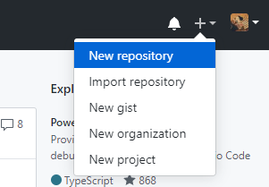
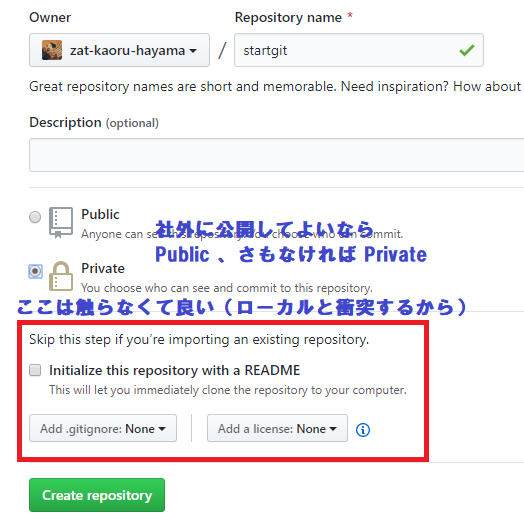
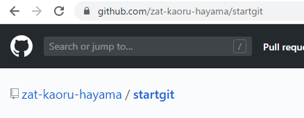

とりあえず、はじめる Git
========================

(1) git 管理するファイルのあるフォルダーに移動
----------------------------------------------

```
cd startgit
```

(2) git ファルダーとして初期化する
----------------------------------

```
git init
```

(3) ファイルを git に登録
-------------------------

```
git add readme.md
```

(4) commit
----------

```
git commit
```

(5) GitHub 側にレポジトリを作る
-------------------------------



---------



---------



(6) ローカルレポジトリの上流を GitHub にする
--------------------------------------------

https://github.com/zat-kaoru-hayama/startgit に origin という名前をつける

```
git remote add origin https://github.com/zat-kaoru-hayama/startgit
```

push する

```
git push -u origin master:master
```

